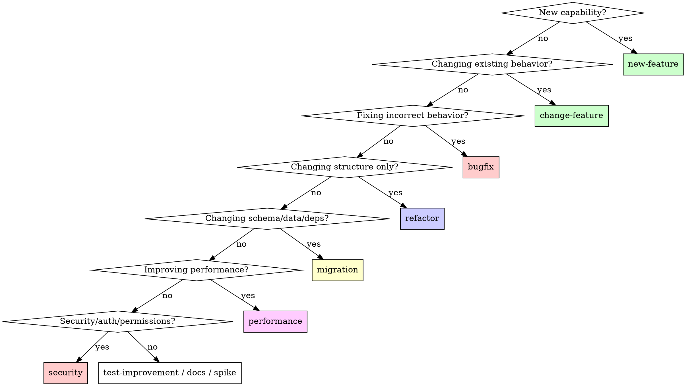
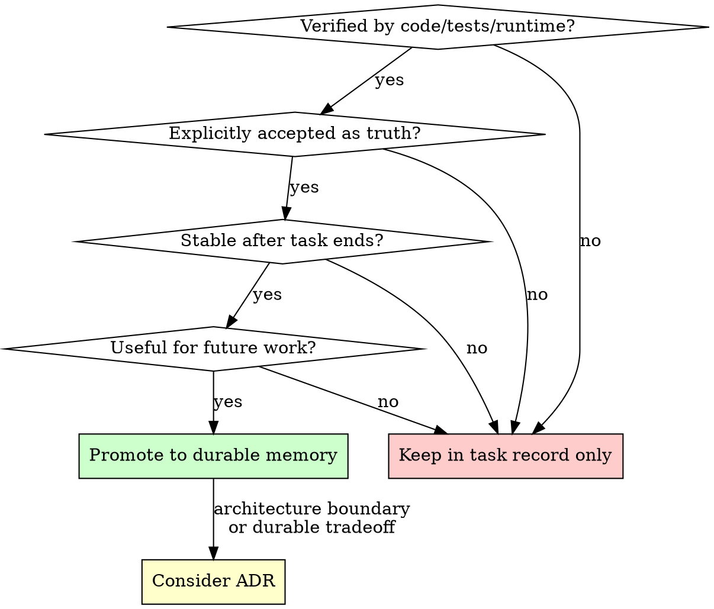
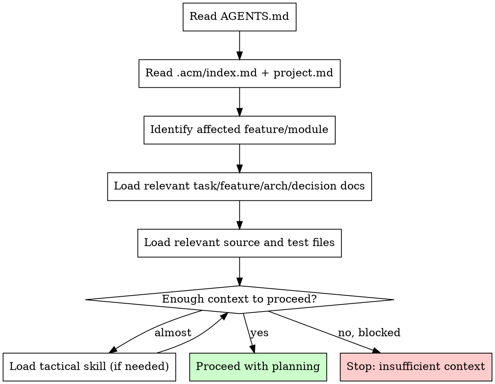

# ACM Enhancement Implementation Plan

> **For agentic workers:** Use `acm-task` to classify and execute this plan phase-by-phase. Each phase is independent and can be implemented incrementally.

**Goal:** Strengthen ACM skill pack by applying proven anti-rationalization, visualization, and verification patterns from superpowers and agent-skills frameworks.

**Architecture:** Incremental enhancement of existing skills. No new core skills. Add mechanisms that prevent agent rationalization while preserving ACM's token-efficient, principle-based design.

**Tech Stack:** Markdown skills, Graphviz diagrams (optional), ACM resource templates

---

## Phase 1: Anti-Rationalization Mechanisms

**Objective:** Add Iron Laws, Rationalization Tables, and Red Flags to prevent agents from bypassing ACM discipline.

**Effort:** 2-3 days | **Impact:** High | **Priority:** Critical

### Task 1.1: Add Iron Laws to Core Skills

**Files:**
- Modify: `skills/acm-task/SKILL.md`
- Modify: `skills/acm-memory/SKILL.md`
- Modify: `skills/acm-completion/SKILL.md`
- Modify: `skills/acm-handoff/SKILL.md`

- [ ] **Step 1: Add Iron Law to acm-task**

Insert after "## Core Rule" section:

```markdown
## Iron Law

NO NON-TRIVIAL CHANGES FROM USER REQUEST ALONE

Before planning or implementing non-trivial work, reconcile:
1. User request
2. Relevant durable project memory
3. Current source code
4. Relevant tests

If these sources conflict in a behavior-affecting way, STOP and report the conflict. Do not guess. Do not infer. Reconcile.

**Violating the letter of this rule is violating the spirit of ACM.**
```

- [ ] **Step 2: Add Iron Law to acm-memory**

Insert after "## Core Rule" section:

```markdown
## Iron Law

NO PROMOTION WITHOUT VERIFICATION OR EXPLICIT ACCEPTANCE

Durable memory must be:
- Verified by current code, tests, or runtime evidence
- Explicitly accepted as intended truth by the user
- Stable enough to matter after the task ends

Unverified assumptions stay in task records. Task docs record what happened. Durable docs record what is true now.

**Violating the letter of this rule is violating the spirit of ACM.**
```

- [ ] **Step 3: Add Iron Law to acm-completion**

Insert after "## Core Principle" section:

```markdown
## Iron Law

NO COMPLETION CLAIMS WITHOUT FRESH VERIFICATION EVIDENCE

If you haven't run the verification command in this session, you cannot claim it passes. "Should work" is not evidence. "Tests pass" without running them is lying.

Before reporting completion:
1. IDENTIFY what evidence proves the claim
2. RUN the verification (fresh, in this session)
3. READ the actual output
4. REPORT the actual result, including gaps

**Violating the letter of this rule is violating the spirit of ACM.**
```

- [ ] **Step 4: Add Iron Law to acm-handoff**

Insert after "## Use For" section:

```markdown
## Iron Law

NO SILENT LOSS OF CONTEXT

When work is incomplete, risky, long-running, or non-obvious, create or update handoff state. Do not assume the next session will remember. Do not assume the diff tells the whole story.

If you cannot answer "what would the next agent need to know?" then handoff is required.

**Violating the letter of this rule is violating the spirit of ACM.**
```

- [ ] **Step 5: Verify Iron Laws are consistent**

Check that all Iron Laws:
- Start with "NO [X] WITHOUT [Y]"
- Include "Violating the letter of this rule is violating the spirit of ACM"
- Are placed prominently after Core Rule/Principle
- Are concise (3-5 lines max)

### Task 1.2: Expand Rationalization Tables

**Files:**
- Modify: `skills/acm-task/SKILL.md`
- Modify: `skills/acm-completion/SKILL.md`
- Modify: `skills/acm-handoff/SKILL.md`
- Modify: `skills/bugfix/SKILL.md`
- Modify: `skills/refactor/SKILL.md`
- Modify: `skills/migration/SKILL.md`

- [ ] **Step 1: Add Rationalization Table to acm-task**

Insert before "## Red Flags" section:

```markdown
## Common Rationalizations

| Rationalization | Reality |
|---|---|
| "This is a trivial edit, no task record needed" | If it affects behavior, tests, or docs, it's non-trivial. When in doubt, create a minimal task record. |
| "I can infer the behavior from the request" | Inference without evidence causes drift. Reconcile sources. |
| "The docs are probably outdated" | Stale docs are a signal to reconcile, not ignore. Check code and tests. |
| "I remember how this works from last session" | Memory is not evidence. Load context and verify. |
| "Creating a task folder is overhead" | Task records prevent the same confusion next time. 5 minutes now saves hours later. |
| "The user said to just do it" | User requests are one source. Reconcile with durable memory, code, and tests. |
```

- [ ] **Step 2: Add Rationalization Table to acm-completion**

Insert before "## Final Response" section:

```markdown
## Common Rationalizations

| Rationalization | Reality |
|---|---|
| "Should work now" | RUN the verification. "Should" is not evidence. |
| "I'm confident it passes" | Confidence ≠ evidence. Run the command. |
| "Tests passed earlier" | Earlier is not this session. Run them again. |
| "I'll verify after I commit" | Verify before commit. Commits are save points, not verification gates. |
| "The change is small, no need to check" | Small changes break things. Verify proportionally. |
| "Lint passed, so it's good" | Lint checks style, not behavior. Run tests. |
```

- [ ] **Step 3: Add Rationalization Table to acm-handoff**

Insert before "## Stale Handoff Handling" section:

```markdown
## Common Rationalizations

| Rationalization | Reality |
|---|---|
| "The next session will figure it out" | They won't have your context. Write handoff. |
| "The diff shows what changed" | Diffs show code changes, not decisions, risks, or next steps. |
| "It's almost done, no handoff needed" | "Almost done" is incomplete. Handoff the remaining work. |
| "I'll remember to continue this" | Sessions don't persist. Write it down. |
| "Handoff is overhead" | Reconstructing context from scratch is more overhead. |
```

- [ ] **Step 4: Add Rationalization Table to bugfix**

Insert before "## Escalate When" section:

```markdown
## Common Rationalizations

| Rationalization | Reality |
|---|---|
| "I know what the bug is, I'll just fix it" | Reproduce first. 30% of "obvious" bugs have different root causes. |
| "The test is probably wrong" | Verify that assumption. If the test is wrong, fix the test. Don't skip it. |
| "It works on my machine" | Environments differ. Check CI, config, dependencies. |
| "I'll add a test later" | Later never comes. Add regression coverage now. |
| "This is a flaky test, ignore it" | Flaky tests mask real bugs. Investigate or fix the flakiness. |
```

- [ ] **Step 5: Add Rationalization Table to refactor**

Insert before "## Escalate When" section:

```markdown
## Common Rationalizations

| Rationalization | Reality |
|---|---|
| "While I'm here, I'll fix this too" | Scope creep. Stay focused on the refactor goal. |
| "This code is ugly, it needs cleanup" | Ugly is not a bug. Refactor with a concrete motivation. |
| "The tests will catch any issues" | Tests verify behavior, not structure. Verify preservation manually. |
| "This is a small refactor, no need for characterization tests" | Small refactors can have subtle behavior changes. Add tests when risk warrants. |
| "I'll document the architecture changes later" | Document while context is fresh. Later becomes never. |
```

- [ ] **Step 6: Add Rationalization Table to migration**

Insert before "## Escalate When" section:

```markdown
## Common Rationalizations

| Rationalization | Reality |
|---|---|
| "The migration is reversible" | Verify that assumption. Some migrations have hidden irreversibility. |
| "Compatibility is not an issue" | Test it. Assumptions about compatibility are often wrong. |
| "We'll handle rollback if needed" | Plan rollback before implementation, not after failure. |
| "This is just a dependency update" | Dependency updates can break APIs, data shapes, or runtime behavior. |
| "The data will migrate fine" | Test with real data. Synthetic data misses edge cases. |
```

### Task 1.3: Expand Red Flags Lists

**Files:**
- Modify: `skills/acm-task/SKILL.md` (expand existing)
- Modify: `skills/acm-memory/SKILL.md` (add new)
- Modify: `skills/acm-completion/SKILL.md` (add new)
- Modify: `skills/acm-handoff/SKILL.md` (add new)

- [ ] **Step 1: Expand Red Flags in acm-task**

Replace existing "## Red Flags" section:

```markdown
## Red Flags - STOP and Reconcile

Stop when you notice:

- "I can infer the behavior" without evidence
- "This probably doesn't need a task record" for multi-step work
- "The docs are probably outdated" without checking
- "I remember how this works" without loading context
- Docs, code, and tests disagree
- Verification path is unclear
- Security, auth, data, billing, public API, or architecture impact is uncertain
- "The user said to just do it" without reconciling other sources
- "This is a quick fix" for behavior-affecting changes
- Skipping task record creation "to save time"

**ALL of these mean: STOP. Load context. Reconcile sources. Create task record.**
```

- [ ] **Step 2: Add Red Flags to acm-memory**

Insert before "## Completion Prompt" section:

```markdown
## Red Flags - STOP and Verify

Stop when you notice:

- "This might help later" without verification
- "The task notes already say it" without promoting
- "The code currently behaves this way" without checking if it's intended
- "I should document everything now" without filtering
- Promoting unverified assumptions
- Promoting temporary debugging notes
- Promoting stale historical behavior
- Creating ADRs for trivial decisions
- Skipping verification before promotion

**ALL of these mean: STOP. Verify evidence. Check if promotion is warranted.**
```

- [ ] **Step 3: Add Red Flags to acm-completion**

Insert before "## Final Response" section:

```markdown
## Red Flags - STOP and Verify

Stop when you notice:

- "Should work now" without running verification
- "I'm confident it passes" without evidence
- "Tests passed earlier" without re-running
- "I'll verify after I commit"
- "The change is small, no need to check"
- Expressing satisfaction before verification ("Great!", "Done!", "Perfect!")
- About to report completion without fresh evidence
- Trusting memory instead of running commands
- Skipping checks "to save time"

**ALL of these mean: STOP. Run verification. Read output. THEN report.**
```

- [ ] **Step 4: Add Red Flags to acm-handoff**

Insert before "## Stale Handoff Handling" section:

```markdown
## Red Flags - STOP and Document

Stop when you notice:

- "The next session will figure it out"
- "The diff shows what changed" without context
- "It's almost done, no handoff needed"
- "I'll remember to continue this"
- Work is incomplete but no handoff exists
- Risky changes with no documentation
- Long-running work with no status update
- Non-obvious decisions with no rationale recorded

**ALL of these mean: STOP. Create or update handoff.md. Preserve context.**
```

### Task 1.4: Verification

- [ ] **Step 1: Review all modified skills**

Check that:
- Iron Laws are prominent and concise
- Rationalization Tables have 5-7 entries each
- Red Flags lists have 8-10 items each
- Language is consistent ("STOP and [action]")
- No duplication across skills

- [ ] **Step 2: Test with sample scenarios**

Create 2-3 test scenarios and verify that:
- Iron Laws prevent rationalization
- Rationalization Tables catch common excuses
- Red Flags trigger stopping behavior

- [ ] **Step 3: Commit Phase 1 changes**

```bash
git add skills/acm-task/SKILL.md skills/acm-memory/SKILL.md skills/acm-completion/SKILL.md skills/acm-handoff/SKILL.md skills/bugfix/SKILL.md skills/refactor/SKILL.md skills/migration/SKILL.md
git commit -m "feat: add anti-rationalization mechanisms to core and tactical skills

- Add Iron Laws to acm-task, acm-memory, acm-completion, acm-handoff
- Add Rationalization Tables to 6 skills
- Expand Red Flags lists to 4 core skills
- Pattern: 'NO [X] WITHOUT [Y]' + 'Violating the letter...'"
```

**Success Criteria:**
- All 4 core skills have Iron Laws
- 6 skills have Rationalization Tables (5-7 entries each)
- 4 core skills have expanded Red Flags (8-10 items each)
- Language is consistent across all skills

---

## Phase 2: Flowcharts & Visual Decision Aids

**Objective:** Add Graphviz diagrams to clarify non-obvious decision points.

**Effort:** 1-2 days | **Impact:** Medium | **Priority:** High

### Task 2.1: Add Task Classification Flowchart

**Files:**
- Modify: `skills/acm-task/SKILL.md`

- [ ] **Step 1: Add classification flowchart**

Insert after "## Task Classification" section:

```markdown
## Classification Decision Flow



**Uncertain classification?** Stop and report the ambiguity. Do not guess when classification affects workflow.
```

### Task 2.2: Add Memory Promotion Flowchart

**Files:**
- Modify: `skills/acm-memory/SKILL.md`

- [ ] **Step 1: Add promotion decision flowchart**

Insert after "## Promote When" section:

```markdown
## Promotion Decision Flow



**When in doubt, keep in task record.** Promotion is for verified, stable, useful facts.
```

### Task 2.3: Add Context Loading Flowchart (Optional)

**Files:**
- Modify: `skills/acm-task/SKILL.md`

- [ ] **Step 1: Add context loading flowchart**

Insert after "## Context Loading" section:

```markdown
## Context Loading Flow



**Stop when:** You cannot identify affected files, expected behavior, verification strategy, risks, or open questions.
```

### Task 2.4: Verification

- [ ] **Step 1: Render flowcharts (optional)**

If Graphviz is available:
```bash
# Render to PNG for documentation
dot -Tpng -o classification-flow.png skills/acm-task/SKILL.md
```

- [ ] **Step 2: Verify flowchart syntax**

Check that:
- All nodes have unique names
- All edges are properly connected
- Decision nodes use diamond shape
- Terminal nodes use box shape with fill color
- Labels are concise

- [ ] **Step 3: Commit Phase 2 changes**

```bash
git add skills/acm-task/SKILL.md skills/acm-memory/SKILL.md
git commit -m "feat: add flowcharts for task classification and memory promotion

- Add classification decision flow to acm-task
- Add promotion decision flow to acm-memory
- Add context loading flow (optional)
- Use Graphviz dot format for consistency"
```

**Success Criteria:**
- 2-3 flowcharts added to clarify non-obvious decisions
- Flowcharts use consistent Graphviz syntax
- Decision points are clearly marked with diamonds
- Terminal states are visually distinct

---

## Phase 3: Concrete Examples

**Objective:** Add before/after scenarios to tactical skills to make patterns concrete.

**Effort:** 3-4 days | **Impact:** High | **Priority:** High

### Task 3.1: Add Examples to bugfix

**Files:**
- Modify: `skills/bugfix/SKILL.md`

- [ ] **Step 1: Add Example section**

Insert before "## Common Mistakes" section:

```markdown
## Examples

### Example 1: Regression Bug with Conflicting Sources

**Scenario:** User reports "task creation fails with special characters"

**Without ACM:**
```
Agent: <starts fixing validation regex based on user request alone>
```

**With ACM:**
```
1. Classify: bugfix
2. Load context:
   - .acm/features/task-creation/behavior.md → "titles accept Unicode"
   - src/validators/task.ts → current regex: /^[a-zA-Z0-9\s]+$/
   - tests/task-creation.test.ts → no Unicode tests
3. Reconcile: 
   - Durable says "Unicode accepted"
   - Code says "ASCII only"
   - Tests don't cover Unicode
   → CONFLICT: behavior-affecting disagreement
4. Stop and report:
   "Durable memory says titles accept Unicode, but code only accepts ASCII.
   Which is the intended behavior?
   - If Unicode: fix regex, add tests
   - If ASCII: update durable memory"
```

**Outcome:** User confirms ASCII-only is correct. Agent updates `.acm/features/task-creation/behavior.md` to match code.

### Example 2: Flaky Test Investigation

**Scenario:** User reports "auth test sometimes fails in CI"

**Without ACM:**
```
Agent: <re-runs test, sees it passes, reports "fixed">
```

**With ACM:**
```
1. Classify: bugfix
2. Load context:
   - .acm/tasks/2026-06-15-auth-test-flake/task.md → previous investigation
   - tests/auth.test.ts → test code
   - CI logs → failure pattern: fails 30% of runs
3. Reproduce:
   - Run test 10 times locally → 3 failures
   - Failure always on line 45: expect(token).toBeDefined()
4. Root cause:
   - Token generation is async
   - Test doesn't await token creation
   - Race condition: sometimes token not ready
5. Fix:
   - Add await before token generation
   - Add regression test that runs 100 times
6. Verify:
   - Run test 100 times → 0 failures
7. Update task record:
   - Document root cause and fix
   - No durable memory update (implementation detail)
```

**Outcome:** Flaky test fixed, regression coverage added, root cause documented in task record.
```

### Task 3.2: Add Examples to refactor

**Files:**
- Modify: `skills/refactor/SKILL.md`

- [ ] **Step 1: Add Example section**

Insert before "## Common Mistakes" section:

```markdown
## Examples

### Example 1: Extract Validation Logic

**Scenario:** User requests "extract validation logic to shared utility"

**Without ACM:**
```
Agent: <extracts validation, breaks 3 tests, doesn't notice>
```

**With ACM:**
```
1. Classify: refactor (no behavior change intended)
2. Load context:
   - .acm/architecture/validation.md → "validation at API boundaries"
   - src/routes/users.ts → inline validation (lines 45-60)
   - src/routes/tasks.ts → inline validation (lines 30-45)
   - tests/users.test.ts, tests/tasks.test.ts → existing tests
3. Define preserved behavior:
   - User validation: email required, name 2-50 chars
   - Task validation: title required, status enum
   - Error format: { code: 'VALIDATION_ERROR', message: string }
4. Add characterization tests (if missing):
   - Test user validation edge cases
   - Test task validation edge cases
   - Verify error format
5. Extract:
   - Create src/lib/validation.ts
   - Move user validation logic
   - Move task validation logic
   - Update routes to use shared utility
6. Verify:
   - Run all tests → pass
   - Check error format unchanged
   - Check validation behavior unchanged
7. Update durable memory:
   - .acm/architecture/validation.md → add shared utility location
```

**Outcome:** Validation extracted, behavior preserved, architecture doc updated.

### Example 2: Scope Creep Prevention

**Scenario:** User requests "refactor auth module"

**Without ACM:**
```
Agent: <refactors auth, also "fixes" logging, also updates error messages>
```

**With ACM:**
```
1. Classify: refactor
2. Load context:
   - .acm/features/auth/behavior.md → "JWT auth, 30min expiry"
   - src/middleware/auth.ts → current implementation
3. Define scope:
   - Motivation: "auth module is 500 lines, hard to test"
   - Goal: "extract token validation to separate function"
   - Non-goals: "don't change logging, error messages, or token format"
4. Notice during refactor:
   - Logging is inconsistent (but out of scope)
   - Error messages could be clearer (but out of scope)
5. Stay focused:
   - Extract token validation only
   - Note other issues in task record: "NOTICED BUT NOT TOUCHING:
     - Logging inconsistency (separate task)
     - Error message clarity (separate task)"
6. Verify:
   - Auth behavior unchanged
   - Tests pass
```

**Outcome:** Refactor completed, scope discipline maintained, other issues noted for future tasks.
```

### Task 3.3: Add Examples to migration

**Files:**
- Modify: `skills/migration/SKILL.md`

- [ ] **Step 1: Add Example section**

Insert before "## Common Mistakes" section:

```markdown
## Examples

### Example 1: Database Schema Migration

**Scenario:** User requests "add priority field to tasks table"

**Without ACM:**
```
Agent: <adds column, updates code, doesn't test rollback>
```

**With ACM:**
```
1. Classify: migration (schema change)
2. Load context:
   - .acm/architecture/database.md → "PostgreSQL, Prisma ORM"
   - .acm/features/tasks/api.md → current task schema
   - prisma/schema.prisma → current model
   - tests/tasks.test.ts → existing tests
3. Capture current state:
   - Task model: id, title, status, createdAt, updatedAt
   - No priority field
4. Define target state:
   - Task model: id, title, status, priority, createdAt, updatedAt
   - priority: enum('low', 'medium', 'high'), default 'medium'
5. Plan migration:
   - Add column with default value (non-breaking)
   - Update Prisma schema
   - Generate migration
   - Update API types
   - Add tests for priority field
6. Plan rollback:
   - Migration is additive (can drop column)
   - No data transformation needed
   - Rollback: drop column, revert schema
7. Verify:
   - Run migration locally → success
   - Run tests → pass
   - Test rollback → success
   - Check API accepts priority field
8. Update durable memory:
   - .acm/features/tasks/api.md → add priority field
   - .acm/architecture/database.md → note migration pattern
```

**Outcome:** Schema migrated, rollback tested, durable memory updated.

### Example 2: Dependency Update with Breaking Changes

**Scenario:** User requests "update React from 17 to 18"

**Without ACM:**
```
Agent: <updates package.json, fixes compilation errors, ships>
```

**With ACM:**
```
1. Classify: migration (dependency update)
2. Load context:
   - .acm/architecture/frontend.md → "React 17, TypeScript"
   - package.json → current dependencies
   - React 18 migration guide → breaking changes
3. Identify breaking changes:
   - ReactDOM.render → createRoot
   - Automatic batching (may affect tests)
   - Strict Mode double-invokes effects
4. Compatibility analysis:
   - 15 components use ReactDOM.render
   - 3 tests rely on effect timing
   - No concurrent features used
5. Plan incremental migration:
   - Phase 1: Update to React 18, keep ReactDOM.render (deprecated but works)
   - Phase 2: Migrate to createRoot (one component at a time)
   - Phase 3: Fix effect timing tests
   - Phase 4: Enable Strict Mode
6. Rollback plan:
   - Revert package.json
   - Revert code changes
   - No data migration needed
7. Verify each phase:
   - Phase 1: Build succeeds, tests pass
   - Phase 2: Each component migration tested
   - Phase 3: Tests updated and passing
   - Phase 4: No new issues in Strict Mode
8. Update durable memory:
   - .acm/architecture/frontend.md → React 18
   - .acm/decisions/2026-06-17-react-18-migration.md → rationale
```

**Outcome:** Dependency updated incrementally, breaking changes handled, decision recorded.
```

### Task 3.4: Add Examples to acm-memory

**Files:**
- Modify: `skills/acm-memory/SKILL.md`

- [ ] **Step 1: Add Example section**

Insert before "## ADR Trigger Heuristic" section:

```markdown
## Examples

### Example 1: Promotion Decision

**Task finding:** "The auth middleware checks JWT expiry at 30 minutes"

**Promote?**
- ✅ Verified by: `src/middleware/auth.ts:45`
- ✅ Stable: unlikely to change frequently
- ✅ Useful: future auth work needs this
- **Decision:** Promote to `.acm/architecture/auth.md`

**Task finding:** "Tried 3 approaches, approach B worked"

**Promote?**
- ❌ Implementation log, not durable truth
- **Decision:** Keep in task record only

**Task finding:** "The bug was caused by a race condition in token generation"

**Promote?**
- ❌ Historical debugging detail
- ✅ But: "Token generation must be awaited" is durable
- **Decision:** Promote the durable fact, not the debugging story

### Example 2: ADR Decision

**Task finding:** "We chose PostgreSQL over MongoDB for the main database"

**Create ADR?**
- ✅ Architecture boundary decision
- ✅ Multiple valid approaches existed
- ✅ Tradeoff will matter in future tasks
- ✅ Affects data model, queries, scaling
- **Decision:** Create `.acm/decisions/2026-06-17-database-choice.md`

**Task finding:** "We used camelCase for variable names"

**Create ADR?**
- ❌ Convention, not architecture boundary
- ❌ Obvious from code inspection
- **Decision:** Document in `.acm/project.md` conventions, no ADR needed
```

### Task 3.5: Add Examples to acm-task

**Files:**
- Modify: `skills/acm-task/SKILL.md`

- [ ] **Step 1: Add Example section**

Insert before "## Stop Conditions" section:

```markdown
## Examples

### Example 1: New Feature with Clear Context

**User request:** "Add task sharing feature"

```
1. Classify: new-feature
2. Load context:
   - .acm/project.md → "task management app, multi-user"
   - .acm/features/tasks/behavior.md → current task features
   - .acm/architecture/database.md → schema
   - src/models/task.ts → current model
3. Reconcile:
   - Request: add sharing
   - Durable: tasks belong to single user
   - Code: userId field on task
   - Tests: no sharing tests
   → No conflict, but sharing requires schema change
4. Create task record:
   - .acm/tasks/2026-06-17-task-sharing/task.md
   - Classification: new-feature
   - Affected: tasks feature, database schema
   - Verification: tests for sharing, manual testing
5. Plan:
   - Add sharedWith field to task
   - Add sharing API endpoints
   - Add UI for sharing
   - Update permissions logic
```

### Example 2: Ambiguous Request

**User request:** "Fix the login"

```
1. Classify: uncertain (bugfix? change-feature?)
2. Load context:
   - .acm/features/auth/behavior.md → "JWT auth, 30min expiry"
   - src/routes/auth.ts → login endpoint
   - tests/auth.test.ts → login tests (all passing)
3. Reconcile:
   - Request: "fix the login"
   - Durable: login works as specified
   - Code: login endpoint exists
   - Tests: all passing
   → CONFLICT: What is broken? Tests pass, durable says it works.
4. Stop and report:
   "I can't identify what's broken with 'the login':
   - Durable memory says login works (JWT, 30min expiry)
   - All login tests pass
   - No recent changes to auth
   
   Can you clarify what's not working?
   - Is it a specific user?
   - A specific error message?
   - A specific scenario?"
```

**Outcome:** Avoided guessing, asked for clarification, prevented wasted work.
```

### Task 3.6: Verification

- [ ] **Step 1: Review all examples**

Check that:
- Examples show "Without ACM" vs "With ACM" contrast
- Examples demonstrate reconciliation of sources
- Examples show stop conditions and escalation
- Examples are realistic and relatable

- [ ] **Step 2: Commit Phase 3 changes**

```bash
git add skills/bugfix/SKILL.md skills/refactor/SKILL.md skills/migration/SKILL.md skills/acm-memory/SKILL.md skills/acm-task/SKILL.md
git commit -m "feat: add concrete examples to tactical and core skills

- Add before/after scenarios to bugfix, refactor, migration
- Add promotion examples to acm-memory
- Add classification examples to acm-task
- Pattern: 'Without ACM' vs 'With ACM' contrast"
```

**Success Criteria:**
- 5 skills have concrete examples
- Examples show contrast (without vs with ACM)
- Examples demonstrate reconciliation and stopping behavior
- Examples are realistic and cover common scenarios

---

## Phase 4: Strengthen Verification Checklists

**Objective:** Expand verification checklists to be more comprehensive and actionable.

**Effort:** 1-2 days | **Impact:** Medium | **Priority:** Medium

### Task 4.1: Expand acm-completion Verification

**Files:**
- Modify: `skills/acm-completion/SKILL.md`

- [ ] **Step 1: Replace "Verification Review" section**

Replace existing section with:

```markdown
## Verification Checklist

Before reporting completion, verify:

### Evidence
- [ ] Fresh verification run in this session (not "should pass")
- [ ] Actual output recorded (not "tests pass")
- [ ] Skipped checks documented with reasons
- [ ] No "I'm confident" without evidence

### Scope
- [ ] Changes match user request
- [ ] No silent scope expansion
- [ ] Unrelated changes excluded
- [ ] No "while I'm here" modifications

### Reconciliation
- [ ] Docs, code, and tests agree on behavior
- [ ] Durable memory updated if truth changed
- [ ] Task record updated if task folder exists
- [ ] No unresolved behavior-affecting conflicts

### Code Quality
- [ ] No weakened validation/auth/error handling
- [ ] No exposed secrets
- [ ] No discarded unrelated work
- [ ] No formatting/debug code remaining
- [ ] Behavior matches durable memory or task intent

### Safety
- [ ] No destructive commands without approval
- [ ] No secrets in commits
- [ ] No discarded user work
- [ ] Read-only inspection before mutation

### Handoff
- [ ] Handoff updated if work incomplete/risky
- [ ] Next steps documented
- [ ] Known risks recorded

### Verification Order (suggested)
1. Targeted unit tests
2. Targeted integration tests
3. Typecheck
4. Lint
5. Build
6. E2E tests (if applicable)
7. Documentation/reference checks

**If no reliable verification exists, say that instead of implying success.**
```

### Task 4.2: Expand acm-task Verification

**Files:**
- Modify: `skills/acm-task/SKILL.md`

- [ ] **Step 1: Add "Output Contract Verification" section**

Insert after "## Output Contract" section:

```markdown
## Output Contract Verification

Before proceeding to implementation, verify you know:

- [ ] Task classification (and why)
- [ ] Affected feature/module (specific files)
- [ ] Expected behavior (from durable memory or user request)
- [ ] Relevant memory files (loaded and read)
- [ ] Relevant source files (loaded and read)
- [ ] Relevant test files (loaded and read)
- [ ] Verification strategy (what checks will prove success)
- [ ] Open risks or assumptions (documented)
- [ ] No behavior-affecting conflicts (or stopped to report)

**If any of these are unclear, stop and gather more context.**
```

### Task 4.3: Expand acm-memory Verification

**Files:**
- Modify: `skills/acm-memory/SKILL.md`

- [ ] **Step 1: Expand "Verification Checklist" section**

Replace existing checklist with:

```markdown
## Verification Checklist

Before promoting memory, verify:

### Evidence
- [ ] Source of truth is identified (code, tests, user acceptance)
- [ ] Evidence is current (not from previous session without re-verification)
- [ ] Behavior is verified or explicitly accepted
- [ ] No unverified assumptions

### Content
- [ ] Information is stable (won't change after task ends)
- [ ] Information is useful (helps future work)
- [ ] No scratch reasoning copied
- [ ] No temporary debugging notes
- [ ] No implementation logs
- [ ] No speculative ideas

### Location
- [ ] Correct durable location chosen
- [ ] Feature truth → `.acm/features/[feature]/`
- [ ] Architecture truth → `.acm/architecture/`
- [ ] Decision rationale → `.acm/decisions/`
- [ ] Project context → `.acm/project.md`

### Indexes
- [ ] Indexes updated when new durable docs created
- [ ] `.acm/index.md` reflects new structure
- [ ] No orphaned durable docs

### ADR (if applicable)
- [ ] Decision changes architecture boundaries
- [ ] Multiple valid approaches existed
- [ ] Tradeoff will matter in future tasks
- [ ] ADR follows template in `resources/adr.template.md`
```

### Task 4.4: Expand acm-handoff Verification

**Files:**
- Modify: `skills/acm-handoff/SKILL.md`

- [ ] **Step 1: Add "Handoff Quality Verification" section**

Insert after "## Quality Checklist" section:

```markdown
## Handoff Quality Verification

Before considering handoff complete, verify:

### Status
- [ ] Current status is accurate (not-started, in-progress, blocked, etc.)
- [ ] Overall outcome completeness is stated (yes/no)
- [ ] Last updated timestamp is current

### Context
- [ ] Task summary is clear and concise
- [ ] What was done is documented
- [ ] Changed files are listed with change summary
- [ ] Important context is captured (decisions, assumptions, risks)

### Verification
- [ ] Verification checks are listed
- [ ] Results are recorded (not "should pass")
- [ ] Skipped checks have reasons
- [ ] Gaps are explicit

### Next Steps
- [ ] Remaining work is listed
- [ ] Recommended next action is concrete
- [ ] Known risks are documented

### Durable Memory
- [ ] Links to durable memory when truth changed
- [ ] No handoff notes in durable locations
- [ ] Handoff is in task folder only
```

### Task 4.5: Verification

- [ ] **Step 1: Review all verification checklists**

Check that:
- Checklists are comprehensive but not redundant
- Items are specific and actionable
- Language is consistent ("verify", "check", "ensure")
- No duplication across skills

- [ ] **Step 2: Commit Phase 4 changes**

```bash
git add skills/acm-completion/SKILL.md skills/acm-task/SKILL.md skills/acm-memory/SKILL.md skills/acm-handoff/SKILL.md
git commit -m "feat: strengthen verification checklists in core skills

- Expand acm-completion verification (evidence, scope, reconciliation, safety)
- Add output contract verification to acm-task
- Expand acm-memory promotion verification
- Add handoff quality verification to acm-handoff"
```

**Success Criteria:**
- All 4 core skills have comprehensive verification checklists
- Checklists cover evidence, scope, reconciliation, safety
- Items are specific and actionable
- Language is consistent across skills

---

## Phase 5: Advanced Patterns (Optional)

**Objective:** Add advanced patterns from agent-skills for high-stakes scenarios.

**Effort:** 1-2 weeks | **Impact:** Medium | **Priority:** Low

### Task 5.1: Create acm-adversarial-review Skill (Optional)

**Files:**
- Create: `skills/acm-adversarial-review/SKILL.md`

- [ ] **Step 1: Create adversarial review skill**

Based on agent-skills' `doubt-driven-development`:

```markdown
---
name: acm-adversarial-review
description: Use when making high-stakes architectural decisions, security-sensitive changes, or irreversible migrations that need fresh-context review.
---

# Skill: ACM Adversarial Review

## Use For

Subject non-trivial, high-stakes decisions to fresh-context adversarial review before they stand.

## When To Use

- Architectural decisions affecting multiple modules
- Security-sensitive changes (auth, permissions, data exposure)
- Irreversible migrations (schema changes, data transformations)
- Decisions with high blast radius (public API, billing, data integrity)
- When confident output would be cheaper to verify now than debug later

## When NOT To Use

- Trivial changes (renaming, formatting, file moves)
- Clear, unambiguous user instructions
- One-line changes with obvious correctness
- User explicitly asked for speed over verification

## The Process

### Step 1: CLAIM - Surface the Decision

Name the decision in 2-3 lines:

```
CLAIM: "The new caching layer is thread-safe under read-heavy workload"
WHY THIS MATTERS: Race condition here corrupts user data
```

### Step 2: EXTRACT - Smallest Reviewable Unit

Extract the artifact and contract, not the reasoning:

- Code: the diff or function (not the whole file)
- Decision: the proposal in 3-5 sentences plus constraints
- Assertion: the claim plus supporting evidence

**Strip your reasoning.** Handing over conclusions biases the reviewer toward agreement.

### Step 3: DOUBT - Invoke Fresh-Context Review

Use adversarial prompt:

```
Adversarial review. Find what is wrong with this artifact.
Assume the author is overconfident. Look for:
- Unstated assumptions
- Edge cases not handled
- Hidden coupling or shared state
- Ways the contract could be violated
- Existing conventions this might break

Do NOT validate. Do NOT summarize. Find issues.

ARTIFACT: <paste artifact>
CONTRACT: <paste contract>
```

**Pass ARTIFACT + CONTRACT only. Do NOT pass the CLAIM.**

### Step 4: RECONCILE - Fold Findings Back

For each finding, classify:

1. **Contract misread** - reviewer misunderstood the contract
2. **Valid + actionable** - real issue requiring change
3. **Valid trade-off** - issue is real but cost of fixing exceeds accepting
4. **Noise** - reviewer flagged something actually correct

### Step 5: STOP - Bounded Loop

Stop when:
- Next iteration returns only trivial findings
- 3 cycles completed (escalate to user)
- User explicitly says "ship it"

## Common Rationalizations

| Rationalization | Reality |
|---|---|
| "I'm confident, skip the review" | Confidence correlates poorly with correctness on novel problems |
| "Spawning a reviewer is expensive" | Debugging a wrong decision in production is more expensive |
| "The reviewer will just nitpick" | Constrain the prompt to "issues that would make this fail" |
| "I'll review at the end" | End-of-work review catches issues too late to fix cheaply |

## Red Flags

- Spawning a reviewer for a one-line rename
- Treating reviewer output as authoritative without re-reading artifact
- Looping >3 cycles without escalating
- Prompting "is this good?" instead of "find issues"
- Skipping review under time pressure on high-stakes decisions
```

### Task 5.2: Add Source Verification to framework-adoption (Optional)

**Files:**
- Modify: `skills/framework-adoption/SKILL.md`

- [ ] **Step 1: Add source verification section**

Based on agent-skills' `source-driven-development`:

```markdown
## Source Verification

When adopting frameworks or libraries, verify patterns against official documentation:

### Source Hierarchy

| Priority | Source | Example |
|----------|--------|---------|
| 1 | Official documentation | react.dev, docs.djangoproject.com |
| 2 | Official blog / changelog | react.dev/blog, nextjs.org/blog |
| 3 | Web standards references | MDN, web.dev |
| 4 | Browser/runtime compatibility | caniuse.com, node.green |

**Not authoritative:**
- Stack Overflow answers
- Blog posts or tutorials
- AI-generated documentation
- Training data (verify it)

### Citation Rules

When implementing framework-specific patterns:

1. Identify exact versions from dependency files
2. Fetch official documentation for the feature
3. Implement following documented patterns
4. Cite sources with full URLs

```typescript
// React 19 form handling with useActionState
// Source: https://react.dev/reference/react/useActionState#usage
const [state, formAction, isPending] = useActionState(submitOrder, initialState);
```

### Unverified Patterns

If you cannot find documentation for a pattern:

```
UNVERIFIED: I could not find official documentation for this pattern.
This is based on training data and may be outdated.
Verify before using in production.
```

### Common Rationalizations

| Rationalization | Reality |
|---|---|
| "I'm confident about this API" | Confidence is not evidence. Training data contains outdated patterns. |
| "Fetching docs wastes tokens" | Hallucinating an API wastes more. One fetch prevents hours of rework. |
| "The docs won't have what I need" | If docs don't cover it, the pattern may not be officially recommended. |
```

### Task 5.3: Verification

- [ ] **Step 1: Test adversarial review skill**

Create a test scenario and verify that:
- Skill provides clear process
- Adversarial prompt is effective
- Bounded loop prevents infinite review

- [ ] **Step 2: Commit Phase 5 changes**

```bash
git add skills/acm-adversarial-review/SKILL.md skills/framework-adoption/SKILL.md
git commit -m "feat: add advanced patterns for high-stakes scenarios

- Add acm-adversarial-review skill for fresh-context review
- Add source verification to framework-adoption
- Based on agent-skills doubt-driven-development and source-driven-development"
```

**Success Criteria:**
- Adversarial review skill provides clear process
- Source verification prevents outdated patterns
- Skills are optional and used only for high-stakes scenarios

---

## Summary

### Phase Effort and Impact

| Phase | Effort | Impact | Priority | Files Modified |
|-------|--------|--------|----------|----------------|
| 1 | 2-3 days | High | Critical | 7 skills |
| 2 | 1-2 days | Medium | High | 2 skills |
| 3 | 3-4 days | High | High | 5 skills |
| 4 | 1-2 days | Medium | Medium | 4 skills |
| 5 | 1-2 weeks | Medium | Low | 2 skills (optional) |

### Total Estimated Effort

- **Minimum (Phases 1-2):** 3-5 days
- **Recommended (Phases 1-4):** 7-11 days
- **Complete (Phases 1-5):** 2-3 weeks

### Success Metrics

After implementation, ACM should have:

- ✅ Iron Laws in 4 core skills
- ✅ Rationalization Tables in 6 skills
- ✅ Expanded Red Flags in 4 core skills
- ✅ 2-3 flowcharts for decision points
- ✅ Concrete examples in 5 skills
- ✅ Comprehensive verification checklists in 4 core skills
- ✅ (Optional) Adversarial review skill
- ✅ (Optional) Source verification in framework-adoption

### Next Steps

1. Review this plan
2. Prioritize phases based on available time
3. Implement Phase 1 (critical)
4. Implement remaining phases incrementally
5. Test with real scenarios
6. Iterate based on feedback
