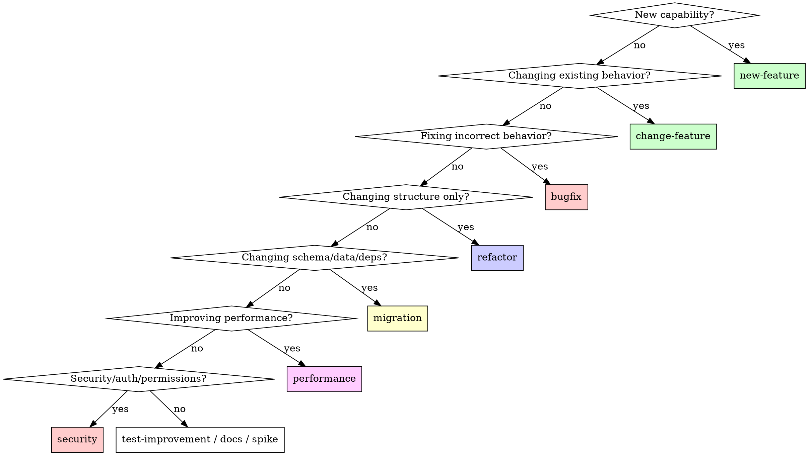
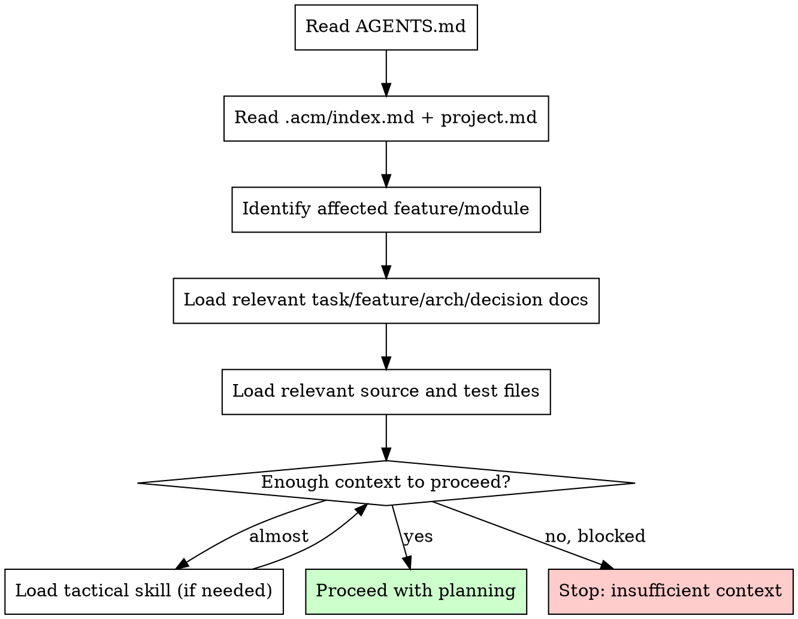

# Skill: ACM Task

## Use For

Classify work, load the smallest safe context, create task records, and plan non-trivial work without copying workflow docs into the target repo.

## When NOT To Use

Do not use this skill for:

- trivial edits where task records would add noise
- pure conversation with no repository impact
- final completion review; use `acm-completion`
- durable memory promotion; use `acm-memory`

## Workflow

1. Classify the task.
2. Load the smallest safe context.
3. Create or update the task record when work is non-trivial.
4. Reconcile request, durable memory, source, and tests.
5. Stop on behavior-affecting conflict.
6. Plan only after enough context exists.

## Output Contract

Before implementation, know:

- task classification
- affected feature/module
- expected behavior or intended non-behavior-change
- relevant memory/source/test files
- verification strategy
- open risks or assumptions

## Core Rule

Do not make non-trivial changes from the user request alone. Reconcile:

1. User request
2. Relevant durable project memory
3. Current source code
4. Relevant tests

If these sources conflict in a behavior-affecting way, stop and report the conflict.

## Iron Law

```txt
NO NON-TRIVIAL CHANGES FROM USER REQUEST ALONE
```

Before planning or implementing non-trivial work, reconcile:
1. User request
2. Relevant durable project memory
3. Current source code
4. Relevant tests

If these sources conflict in a behavior-affecting way, STOP and report the conflict. Do not guess. Do not infer. Reconcile.

**Violating the letter of this rule is violating the spirit of ACM.**

## Task Classification

| Classification | Use When |
|---|---|
| `new-feature` | Adding a capability that did not exist before |
| `change-feature` | Changing existing feature behavior |
| `bugfix` | Fixing incorrect behavior, regression, failing tests, or runtime errors |
| `refactor` | Changing internal structure without intended behavior change |
| `migration` | Changing schema, data shape, dependency, framework, runtime, docs structure, or infrastructure |
| `performance` | Improving latency, throughput, memory, bundle size, query cost, or resource usage |
| `security` | Fixing or improving auth, permissions, validation, secrets, trust boundaries, or data exposure |
| `test-improvement` | Adding or improving tests without intended product behavior change |
| `docs` | Documentation-only changes |
| `spike` | Research, exploration, proof of concept, or decision support |

If classification is uncertain and affects workflow, stop and report the ambiguity.

## Classification Decision Flow



**Uncertain classification?** Stop and report the ambiguity. Do not guess when classification affects workflow.

## Context Loading

Load context progressively:

1. `AGENTS.md` or equivalent project bootstrap instructions
2. `.acm/index.md` and `.acm/project.md` when present
3. Relevant task, feature, architecture, decision, source, and test files
4. Relevant tactical skills only when needed

Stop when enough context exists to identify affected files, expected behavior, verification strategy, risks, and open questions.

## Context Loading Flow



**Stop when:** You cannot identify affected files, expected behavior, verification strategy, risks, or open questions.

## Task Records

For non-trivial work, create or update:

```txt
.acm/tasks/[YYYY-MM-DD-task-slug]/task.md
```

Use the smallest artifact set that preserves state safely:

- Minimal: `task.md`
- Standard: `task.md`, optional `verification.md`
- Handoff/risky: `task.md`, optional `plan.md`, `verification.md`, `handoff.md`

Task docs are working memory and task history. They are not final durable feature truth.

## Task Folder Granularity

One task folder should represent one user outcome or logical feature/change.

Keep tightly related phases in one folder. Create a separate folder when the work becomes a different logical outcome, can ship independently, or changes classification materially.

## Stop Conditions

Stop and report when:

- expected behavior is ambiguous
- source of truth cannot be determined
- docs conflict with code/tests in a behavior-affecting way
- security, auth, billing, data integrity, or public API impact is unclear
- required verification is impossible or unreliable
- implementation would require a broad rewrite not requested

Report what is unclear, which sources conflict, why it matters, and recommended options.

## Common Rationalizations

| Rationalization | Reality |
|---|---|
| "This is a trivial edit, no task record needed" | If it affects behavior, tests, or docs, it's non-trivial. When in doubt, create a minimal task record. |
| "I can infer the behavior from the request" | Inference without evidence causes drift. Reconcile sources. |
| "The docs are probably outdated" | Stale docs are a signal to reconcile, not ignore. Check code and tests. |
| "I remember how this works from last session" | Memory is not evidence. Load context and verify. |
| "Creating a task folder is overhead" | Task records prevent the same confusion next time. 5 minutes now saves hours later. |
| "The user said to just do it" | User requests are one source. Reconcile with durable memory, code, and tests. |

## Red Flags - STOP and Reconcile

Stop when you notice:

- "I can infer the behavior" without evidence
- "This probably doesn't need a task record" for multi-step work
- "The docs are probably outdated" without checking
- "I remember how this works" without loading context
- Docs, code, and tests disagree
- Verification path is unclear
- Security, auth, data, billing, public API, or architecture impact is uncertain
- "The user said to just do it" without reconciling other sources
- "This is a quick fix" for behavior-affecting changes
- Skipping task record creation "to save time"

**ALL of these mean: STOP. Load context. Reconcile sources. Create task record.**

## Resources

Task templates and classification profiles live under this skill's `resources/` directory.
